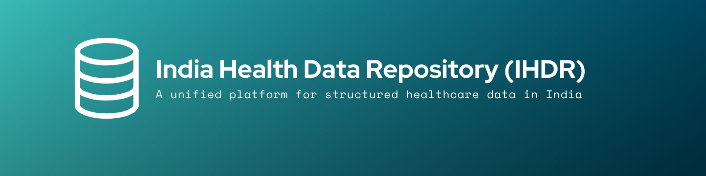

# 🇮🇳 India Health Data Repository (IHDR)
### Empowering Healthcare Innovation with Structured Indian Health Data 🚀

India Health Data Repository (IHDR) is a **centralized platform** designed to aggregate and structure Indian health data from various sources, including **government records, hospitals, research papers, and crowd-sourced inputs**. It aims to support **AI models, researchers, startups, and healthcare companies** by providing **secure, structured, and scalable** health datasets.

IHDR aligns with **India's Ayushman Bharat Digital Mission (ABDM)** and integrates seamlessly with existing **digital health initiatives**.

---

## 🌟 Key Features

✅ **Structured Medical Datasets** – Disease trends, prescriptions, imaging data, and genomic information.  
✅ **Real-time Health Trends** – Track epidemic outbreaks, pollution impacts, and health indicators.  
✅ **Research Data Hub** – Integrates findings from Indian medical research institutions.  
✅ **APIs for AI Training** – Provides structured datasets for AI startups and institutions.  
✅ **Blockchain-based Data Integrity** – Ensures transparency and security in data handling.  
✅ **Federated Learning Support** – AI training without exposing raw patient data.  

---

## 🔥 Challenges & Solutions

### 🔴 Data Extraction

#### Government & Public Healthcare Data
- **Sources**: ABDM, National Health Portal (NHP), ICMR, MoHFW, state health databases.  
- **Methods**: APIs, web scraping, direct partnerships.  

#### Hospitals, Labs & Clinics
- **Sources**: AIIMS, Apollo, Fortis, Dr. Lal PathLabs, etc.  
- **Methods**: FHIR standards for EHR integration, secure anonymized data sharing.  

#### Unstructured Data Processing
- **Sources**: Research papers, pharma reports, news articles.  
- **Methods**: NLP-based scraping, OCR for document digitization.  

#### Crowd-Sourced Data
- **Sources**: Doctors, researchers, public contributions.  
- **Methods**: Incentivized models for data sharing via secure user portals.  

### 🔵 Data Storage & Scalability

- **Cloud & Distributed Databases**: Google Cloud Healthcare API, AWS S3  
- **Databases**: MongoDB Atlas (NoSQL), PostgreSQL (Relational)  
- **Data Lake for AI Training**: Delta Lake, Apache Hadoop, Apache Spark  
- **Blockchain Security**: Hyperledger Fabric, Ethereum Smart Contracts  
- **Federated Learning**: TensorFlow Federated  

---

## 🛠️ Tech Stack

| Technology | Purpose |
|------------|---------|
| **React.js** | Frontend UI |
| **Vite** | Fast development tooling |
| **TypeScript** | Strongly-typed JavaScript |
| **Tailwind CSS** | UI Styling |
| **shadcn-ui** | Prebuilt UI components |
| **MongoDB Atlas** | NoSQL database |
| **PostgreSQL** | Relational database |
| **Google Cloud & AWS** | Cloud storage & APIs |
| **Hyperledger Fabric** | Blockchain for data integrity |
| **TensorFlow Federated** | Privacy-preserving AI training |

---

## 🏠 Installation & Setup

### 📌 Prerequisites
Ensure you have **Node.js & npm** installed. [Download Here](https://nodejs.org/)

### 🚀 Frontend Setup
```sh
# Step 1: Clone the repository
git clone <YOUR_GIT_URL>

# Step 2: Navigate to the project directory
cd ihdr-project

# Step 3: Install dependencies
npm install

# Step 4: Start the development server
npm run dev
```

### 🚀 Backend Setup
```sh
# Step 1: Navigate to the backend directory
cd IHDR_PYTHON

# Step 2: Create a virtual environment (optional but recommended)
python -m venv venv
source venv/bin/activate  # On Windows: venv\Scripts\activate

# Step 3: Install dependencies
pip install -r requirements.txt

# Step 4: Run the backend server
python app.py
```

### 🔍 Uploading Data & Getting Insights
- Upload your **.CSV file** through the UI.
- Click on **Upload**.
- Get **data insights** and **visualizations** automatically.

---

## 🌐 Website Features

📊 **Data Marketplace** – Request datasets for research & AI development.  
🔗 **API Access** – Secure pay-per-use model for structured data access.  
📈 **Interactive Dashboards** – Real-time health trends & insights.  
🔍 **AI-powered Search** – Query-based data retrieval.  
🛡 **Compliance & Privacy** – Fully adheres to **GDPR & India’s DPDP Act**.  

---

## 💰 Monetization Model

- **Freemium Access** – Public users can access general health insights for free.
- **Premium Data & Insights** – Research organizations, governments, and AI startups can **purchase** advanced insights.
- **API Monetization** – Secure pay-per-use access to structured health data.
- **B2B Partnerships** – Collaborations with startups, pharma firms, and research institutions.
- **Government Collaborations** – Aligning with national health initiatives.

---

## 📅 Roadmap & Future Plans

👉 **Phase 1**: Build core platform (Data Aggregation, API Access, AI Training Datasets).  
👉 **Phase 2**: Expand hospital & research partnerships, launch AI-powered analytics tools.  
👉 **Phase 3**: Implement federated learning & blockchain-based patient consent models.  

---

## 💌 Contact

🏋 **For Collaborations & Partnerships:**  
📧 [2516abhi43@gmail.com](mailto:2516abhi43@gmail.com) | [utkarsh.cloudops@gmail.com](mailto:utkarsh.cloudops@gmail.com)

---

## 🏆 Why Choose IHDR?

IHDR is a **first-of-its-kind initiative** designed to revolutionize Indian healthcare data by making it **structured, secure, and accessible**. With a **cutting-edge tech stack, real-time insights, and AI-friendly datasets**, it is poised to **transform research, diagnostics, and healthcare innovation in India**.

🚀 **Join us in building the future of Indian healthcare!**
